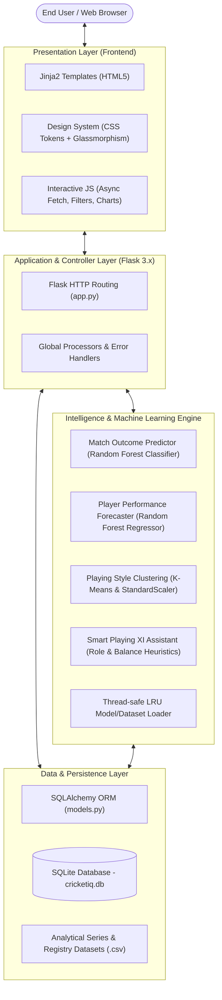
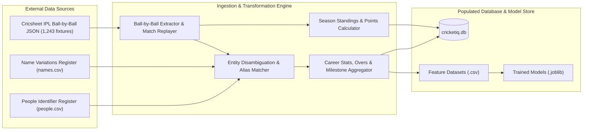
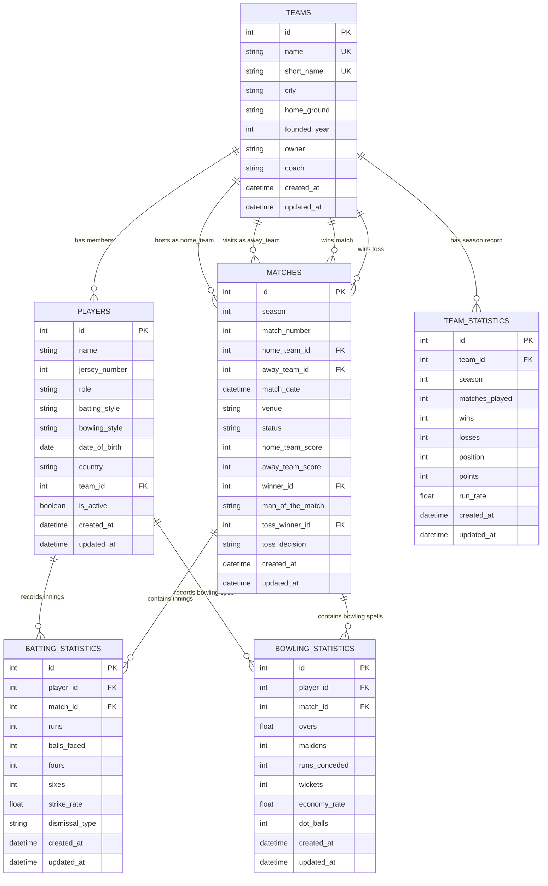
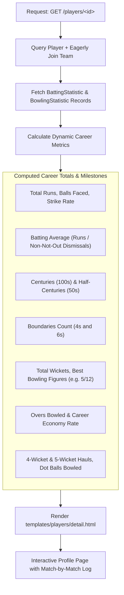
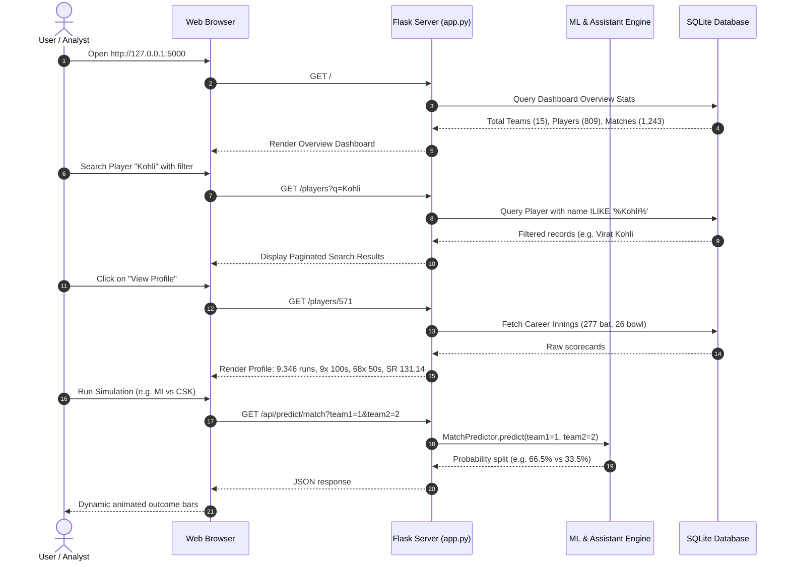

# CricketIQ — Complete Project Explanation & System Architecture

CricketIQ is an end-to-end Indian Premier League (IPL) data analytics, exploration, and intelligence platform. It ingests official ball-by-ball IPL records from **2008 through the present**, maintains an optimized relational database of teams, players, matches, scorecards, and standings, provides dedicated player profile analysis with career milestones, and powers predictive machine learning models.

---

## 1. System Architecture Overview

The system follows a clean **Model-View-Controller (MVC)** and tiered service-oriented architecture:



---

## 2. Complete Historical Data Pipeline (2008 – Present)

CricketIQ features an automated ingestion engine ([`scripts/build_comprehensive_ipl_db.py`](file:///d:/CricketIQ/scripts/build_comprehensive_ipl_db.py)) that downloads, cross-references, validates, and populates ball-by-ball data across all IPL seasons:



### Ingestion Metrics Summary
- **Seasons Covered**: All 18 IPL seasons (2008 Inaugural match through 2026 season)
- **Matches Ingested**: 1,243 matches
- **Active & Historical Franchises**: 15 teams
- **Squad Players Logged**: 809 cricketers
- **Batting Innings**: 18,842 innings
- **Bowling Spells**: 14,734 spells
- **Career Runs Tracked**: 381,529 runs
- **Career Wickets Tracked**: 13,482 wickets

---

## 3. Database Entity Relationship (ER) Diagram

The relational schema is defined via SQLAlchemy in [`models.py`](file:///d:/CricketIQ/models.py) and enforced in SQLite with relational foreign keys and indexes:



---

## 4. Dedicated Player Profile Architecture

Every player in the database has a dedicated profile accessible at `/players/<player_id>` (e.g. [`/players/571`](http://127.0.0.1:5000/players/571) for Virat Kohli):



---

## 5. Intelligence & Machine Learning Subsystems

CricketIQ integrates three machine learning models and one rule-based optimization engine in the [`lib/`](file:///d:/CricketIQ/lib/) directory:

```mermaid
graph LR
    subgraph Subsystems ["Intelligence Features"]
        subgraph Sub1 ["1. Match Predictor"]
            MInput["Inputs: Team 1, Team 2, Venue, Toss"] --> RFC["Random Forest Classifier (100 Trees)"]
            RFC --> MProb["Win Probability & Contextual Factors"]
        end

        subgraph Sub2 ["2. Run Forecaster"]
            FInput["Input: Player ID + Lag 1-3 Innings"] --> RFR["Random Forest Regressor (50 Trees)"]
            RFR --> FRuns["Projected Runs for Next Match"]
        end

        subgraph Sub3 ["3. Similarity Engine"]
            SInput["Input: Player Stats Vector (Avg, SR, Wkts, Econ)"] --> Scaler["StandardScaler"]
            Scaler --> KM["K-Means Clustering (k=8)"]
            KM --> Peers["Top 5 Statistical Peers"]
        end

        subgraph Sub4 ["4. XI Assistant"]
            AInput["Input: Team Squad + Opposition"] --> Balancer["Role Optimization Heuristic"]
            Balancer --> XI["Balanced 11 (5 Bat, 1 Wk, 2 AR, 3 Bowl)"]
        end
    end
```



---

## 6. End-to-End User Interaction Flow



---

## 7. Directory Structure & File Map

```
CricketIQ/
├── app.py                      # Flask routes, API endpoints, error handlers
├── config.py                   # Environment, SQLite, and MySQL configs
├── models.py                   # SQLAlchemy schema (6 core tables)
├── requirements.txt            # Python dependencies
│
├── data/
│   ├── historical_matches.csv  # 1,218 feature rows for match predictor
│   ├── player_stats.csv        # 809 player stat vectors for clustering
│   ├── player_performance_series.csv # 18,842 chronological innings for forecasting
│   ├── people.csv              # Official Cricsheet people identifiers
│   └── names.csv               # Official Cricsheet alternate names
│
├── instance/
│   └── cricketiq.db            # Complete SQLite relational database
│
├── lib/
│   ├── loaders.py              # Thread-safe LRU caching loaders
│   ├── ml_models.py            # Model training classes (RFC, RFR, KMeans)
│   ├── predictor.py            # MatchPredictor & PlayerForecaster runtime classes
│   ├── similarity.py           # PlayerSimilarity clustering lookup
│   └── assistant.py            # TeamAssistant Playing XI heuristic
│
├── models/                     # Serialized scikit-learn artifacts (.joblib)
│   ├── match_predictor.joblib
│   ├── player_forecaster.joblib
│   ├── player_clustering.joblib
│   └── player_scaler.joblib
│
├── scripts/
│   ├── build_comprehensive_ipl_db.py  # Complete scraping, parsing, DB & ML pipeline
│   ├── generate_dataset.py            # Synthetic dataset generator fallback
│   └── real_players_data.py           # Enriched squad attributes mapping
│
├── static/
│   ├── css/style.css           # Premium token-based design system
│   └── js/                     # Modular frontend logic
│       ├── main.js             # Theme toggle, drawer, tables
│       ├── analytics.js        # Chart.js visualization logic
│       ├── intelligence.js     # XI Assistant & Similarity client
│       └── predictions.js      # Match and Forecaster client
│
├── templates/                  # Jinja2 HTML templates
│   ├── base.html               # Shared layout, icons, navigation
│   ├── index.html              # Dashboard home page
│   ├── analytics/index.html    # Season performance charts
│   ├── intelligence/           # Assistant & Similarity views
│   ├── matches/                # Match lists & scorecards
│   ├── players/                # Directory & dedicated profiles
│   └── teams/                  # Franchise directory & rosters
│
└── docs/                       # Project documentation, PDF, PPTX & diagrams
```
